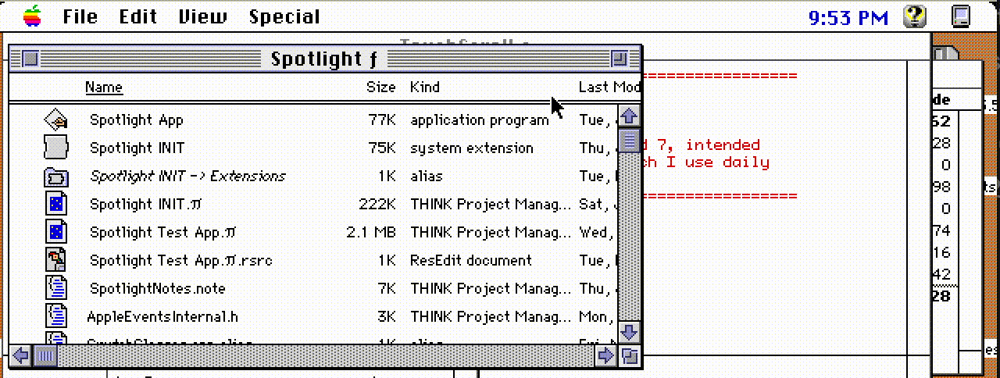

# TouchScroll

**iOS-style touch scrolling for System 6 and 7.**

TouchScroll is a classic Mac OS extension (INIT) that makes vintage Macs scroll like
an iPhone: drag anywhere in a window's content area to scroll it, flick for inertial
scrolling, and get a satisfying rubberband bounce when you hit the end of a document.
No clicking on 16-pixel-wide scroll bar arrows required.

It was built for — and is glorious with — [Mini vMac for iOS](https://github.com/zydeco/minivmac4ios)
and other classic Mac emulators on the iPad, where your finger *is* the mouse. A
finger-drag on the screen arrives at the emulated Mac as a mouse drag, TouchScroll
picks it up, and suddenly System 7 feels like it shipped with a touchscreen.
Scroll bars on a 9-inch-Mac-sized screen are hopeless touch targets; the entire
window as a scroll surface works the way your thumb already expects.

## Features

- **Swipe to scroll** — drag vertically anywhere in a window with a vertical
  scroll bar; a grabber cursor appears and the content follows your finger
- **Inertial scrolling** — flick and release; scrolling continues and decelerates
  smoothly, with sub-line "partial" scrolls between full line scrolls to keep
  motion fluid even in apps that scroll a whole line at a time
- **Rubberband bounce** — overscroll at either end and the content springs back;
  this also works when you hold a scroll arrow past the end of a document
  ("normal scroll bounce")
- **Turbo mode** — hold ⌘ during an inertial scroll to speed it up; tap ⌘
  repeatedly to accelerate to maximum speed
- **Instant brake** — press any other key (even Shift) to stop an inertial scroll
  the moment you spot what you were looking for
- **App-aware** — special handling for the Finder (stays out of the way of icon
  views), THINK Project Manager, THINK Reference, MacPaint, ResEdit, and other
  apps with nonstandard scrolling behavior

TouchScroll works system-wide by patching the Toolbox traps involved in event
handling and scrolling (`SystemEvent`, `FindControl`, `TrackControl`, `ScrollRect`,
`CopyBits`, and friends), so it works in almost any app that uses standard vertical
scroll bars — no per-app support needed.

## Requirements & installation

- System 6 (with MultiFinder) or System 7 — developed and tested primarily on 7.5.5
- Drop `TouchScroll` into your System Folder (or Extensions folder under System 7)
  and restart

## Building

TouchScroll builds with THINK C 6 / Symantec C++ 7 as an INIT code resource; the
project file is `TouchScroll.π`. This repository includes tooling
([`tools/mac-forks`](tools/mac-forks)) for round-tripping the MacRoman/CR sources
and resource forks between a modern git checkout and a vintage disk image.

## Known limitations

- **Vertical scrolling only** (horizontal may come one day; maybe not)
- **Not compatible with Snow's fast-forward mode.** Snow's fast-forward works by
  uncapping the emulated clock, so the virtual Mac's `TickCount` races far ahead
  of real time. TouchScroll judges gestures by how many *emulated* ticks they
  take — and under fast-forward, a real human swipe (a fraction of a real second,
  but hundreds of emulated ticks) looks impossibly slow, so TouchScroll concludes
  it isn't a swipe at all and stays out of the way. Drop out of fast-forward and
  scrolling behaves normally again.
- A few apps scroll in ways that can't be fully supported: apps that redraw the
  whole window instead of blitting (ResEdit's hex dump view) don't get the
  rubberband effect, and apps that abuse the scroll bar's control value (HexEdit)
  may rubberband when they shouldn't. TouchScroll degrades gracefully in these.

## License

MIT — see [LICENSE](LICENSE).
